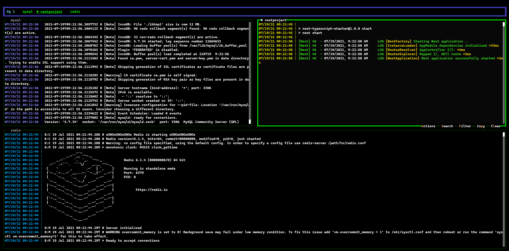

## DNV UI

Frictionless Node Development in Docker Compose

## Install

```console
$ npm install dnv -g
```

## Short description

DNV works behind the scenes to keep dependencies in your Docker container in-sync with your your local project.
It also ships with a very robust multi-plexing UI, custom made for Docker Compose project.



## Basic Usage

When you're in a project directory (it has a package.json file, at a minimum):

### Init

```console
$ dnv init
```

### UI

```console
$ dnv ui
```
